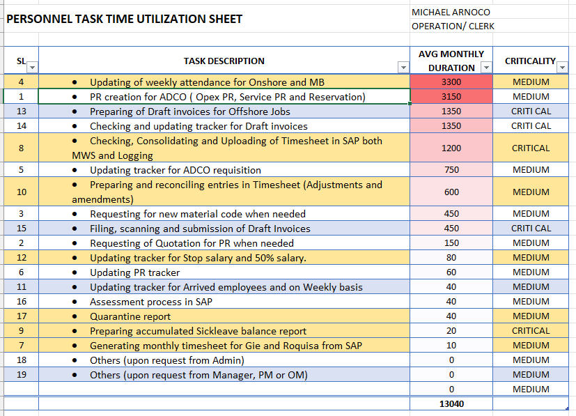
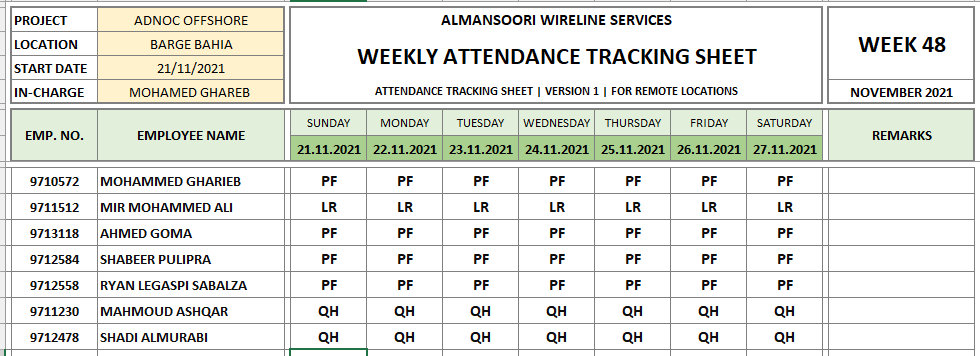
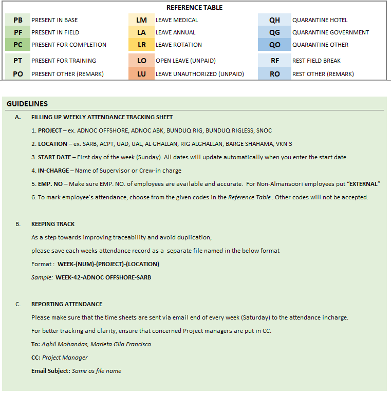
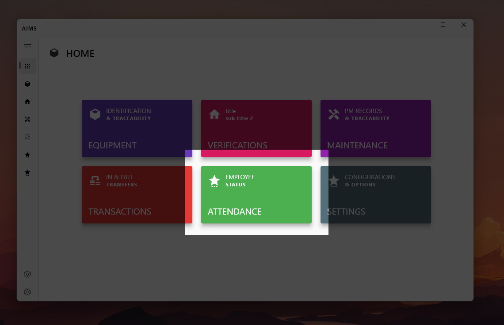

Dear Team,

I wish you all a very prosperous new year.

I'm writing this email to discuss with you an initiative to improve the efficiency and structure of various operational support processes. The email is quite long as it discusses a large scope. (10 minutes to read). Please feel free to prioritize it as of low importance and read it at your convenience.
## BUSINESS PROCESS OPTIMIZATION (BPOP / POP)

### WHAT?
Process optimization is a structured approach towards business processes aimed at improving efficiency by reducing time, money, and effort spent on various repetitive business processes. This can be achieved by following the key steps below.
- Measuring the time consumed for each business process at a granular level.
- Recognizing the non-critical tasks that consume a large portion of man-hours.
- Studying the said tasks by understanding the key factors causing additional overheads.

- Reducing the time and effort put into said tasks by utilizing the right tools.
    
### WHY?

> **Time** is our greatest enemy in this business.

We are working in a very competitive market that needs us to constantly adapt and improve ourselves. With increasing quality assurance, conformance, and client requirements and limited personnel, time, and resources, it becomes crucial that we embrace change and continuously improve our business and processes to their optimal levels.
The most obvious benefit of business process optimization is how it can improve your company’s efficiency. Many processes continue to rely on inefficient systems or even require manual input on tasks that could be performed automatically. This results in wasted time and resources, which minimizes your ability to maintain productivity and adds undue stress to you and your colleagues. By automating select tasks and streamlining others, business process optimization will allow us to operate more efficiently and devote more of our time to tasks that will grow our company.
### HOW?
Depending on the methodology you use for optimization, the process will differ. However, there are usually at least these three stages involved when optimizing a process.
#### MEASURE 📏
>We cant improve what we cant **measure**

For us to get a clear picture on which processes consume more time and effort, and to evaluate the importance of optimising them, we need to first measure all tasks undertaken by us. This is easily accomplished by noting how much time you spent on each task on a typical weekday.Think about where your time and effort are most spent.
#### IDENTIFYING THE PROCESS 🔍
Once you have clearly measured your time utilization, we can start working on identifying the processes that need optimization.
#### ANALYZING THE PROCESS 👀
After identifying the process, it must be analyzed. This essentially means looking at how the process operates and discovering where improvements can be made.

Ask yourself the following questions:

    [ ] Are there processes that take too long to complete?
    [ ] Do you still trip up and make mistakes when following processes?
    [ ] Are there bottlenecks or places where workflows stall?
    [ ] Do any of these processes have wasteful steps?
    [ ] Have you found you’re not getting the desired results from these processes?
    [ ] Could these processes be bettered in any way, shape, or form?
#### IMPLEMENTING CHANGES 💡
Once we have an idea of what changes should be made, they can be moved to implementation. This is where amendments are made to the process. Usually, the implemented changes will cause positive results. If they don’t, then another round of process optimization may be in order.

---
## PROOF OF SUCCESS
In the month of June 2021 MWS Workshop team worked together to list down tasks taken care by each personnel and howmuch time it took to complete each of them.

With these sheets, we identified that processing attendance and uploading them to SAP before payroll every month, took considerable time out of our operation support staff. Furthermore, we also noticed many errors happening in attendance records and subsequently in salary disbursals.

        WE WERE SPENDING   
        100+ HOURS => MORE THAN 12 FULL DAYS (8 HOURS) EVERY MONTH TO PROCESS ATTENDANCE.
In the past few months, we have worked on optimizing the process by introducing the below changes.
- Revised Attendance Template to capture all necessary information.   -
Information related to personnel quarentine, travel, etc. was captured.
- Standardized weekly attendance tracking sheet [WATS] and ensured it was followed by all contact points.
  - This reduced confusion and helped mitigate errors while processing the data by a large margin.
  
- Provided clear guidelines on how to use the form with markings and locks.
  - This helped reduce manual errors usually caused from field. 

- Enforced sharing of data in excel sheet
  Attendance sheets were previously collected as scanned copies and thus had to be manually converted before being uploaded into SAP. It consumed a large amount of time and resulted in errors.
  - Moving to excel sheets helped us process the same data in half the time and reduced errors.
- Developed an automation system to convert collected excel sheets to usable upload data.
  - This helped reduce data processing time from hours to minutes with minimal manual effort.
  
  

I'm happy to inform you that with these optimizations, we were able to reduce process time **from 12 days to less than 3 days.** Most of the time is spent on checking the accuracy of the information rather than manually entering it into the system.

We were also able to reduce attendance record errors from an average of **18 employees having attendance record errors** to **1 employee having an error in their record** this month (**attendance recieved from field was not correct for the 1 employee this month).

---

## WHAT NOW?

As an initiative for the new year, i would like to review work hours of entire MWS UAE Operations Support team. I sincerely believe this will help improve our efficiency and, therefore, division performance.

As a first step (**MEASURE**), I would like to request that everyone on the operations support team review your time utilization and share it with me using the attached template.
We will consolidate the provided information to better understand what process we need to improve next and proceed with it.

We have already started working on optimizing **EQUIPMENT MAINTENANCE MANAGEMENT** as a Q1 objective. I am requesting your inputs to identify the next process for optimization.

Thank you for your time and consideration.

Regards,

Aghil